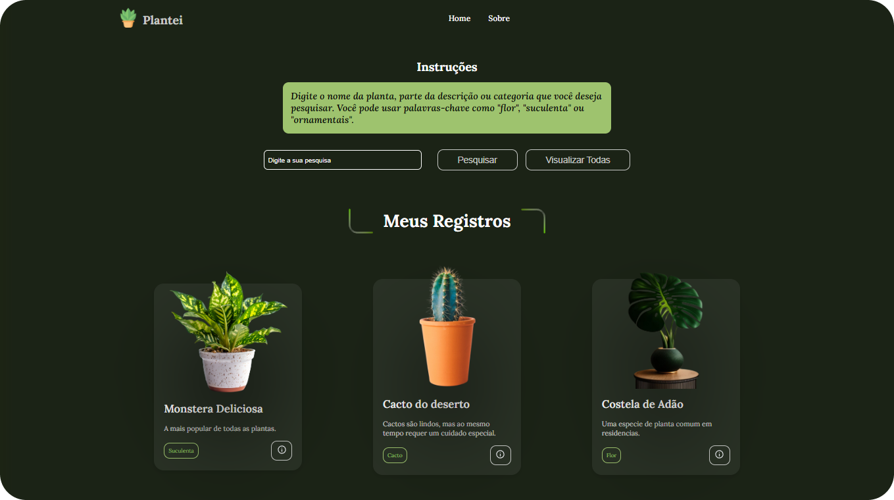

# PLANTEI (gerenciador de jardim)

## Screenshots



## Sobre o Projeto

O Plantei foi desenvolvido como desafio da Imersão Dev - Google Gemini, da Alura. Nele, você pode pesquisar pelas plantas pré-cadastradas na base de dados. O seu visual é baseado no tema proposto para aplicação.

## Tecnologias Utilizadas

- **HTML5:** Estrutura da página
- **CSS3:** Estilização visual
- **JavaScript:** Lógica e interatividade

  

## Progresso do Projeto

### ✅ Features

- [x] Responsividade
- [x] Menu Mobile
- [x] Base de Dados em arquivo externo **(data.js)**
- [x] Pesquisa por termos (título, descrição, categoria)
- [x] Validação para itens ou termos não localizados.

## Como Contribuir

Como Contribuir para o Projeto
Agradecemos seu interesse em contribuir para o projeto Alura Games Nostálgicos!

Para contribuir com o projeto, siga os passos abaixo:

1. Faça um Fork do Repositório:

- Acesse o repositório no GitHub: https://github.com/DiegoReports/plantei.git
- Clique no botão "Fork" no canto superior direito. Isso criará uma cópia do repositório em sua própria conta do GitHub.

2. Clone o Repositório Forkado:

- Abra seu terminal ou prompt de comando.
- Navegue até o diretório onde deseja clonar o repositório.
- Execute o seguinte comando, substituindo **seu_usuario** pelo seu nome de usuário no GitHub:

```Bash
git clone https://github.com/seu_usuario/plantei.git
```

## Autor

Feito com ❤️ por [Diego Henrique](https://www.linkedin.com/in/diego-henrique-sg/) na Imersão Dev da [Alura](https://www.alura.com.br/) com [Google Gemini](https://goo.gle/AluraGemini)
